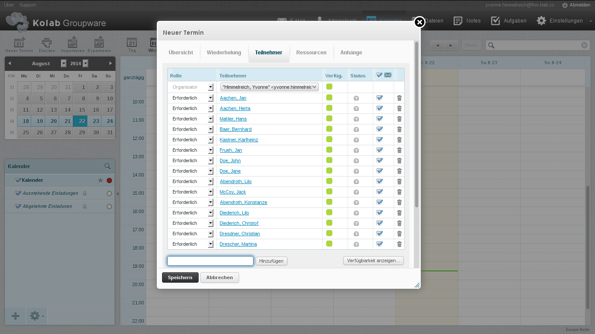
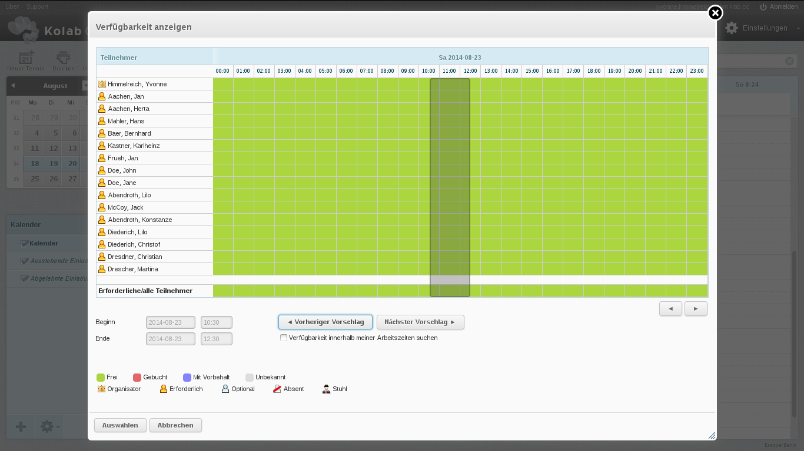
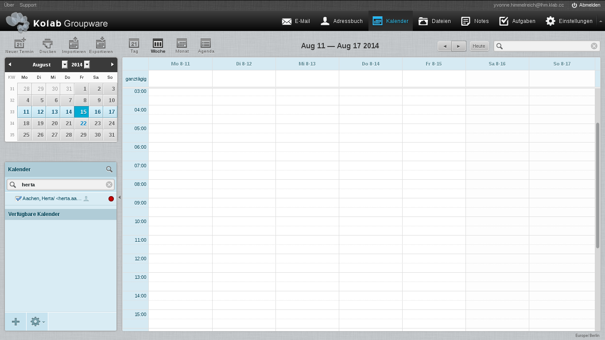
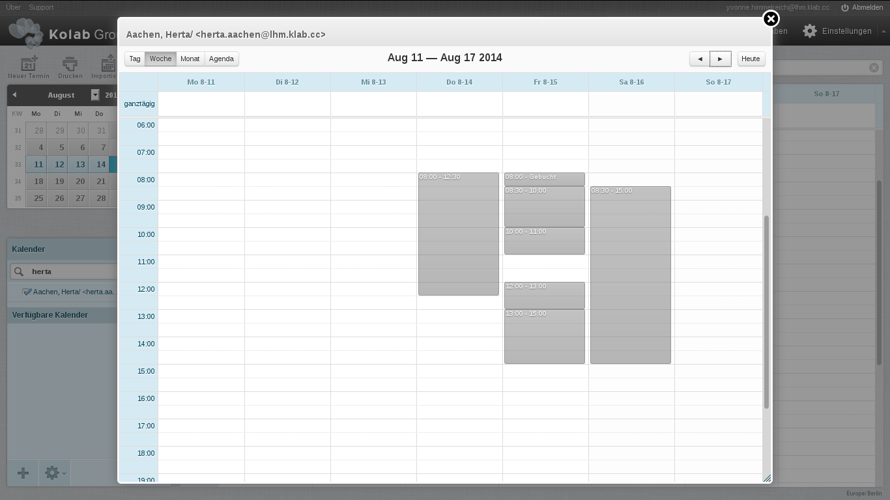
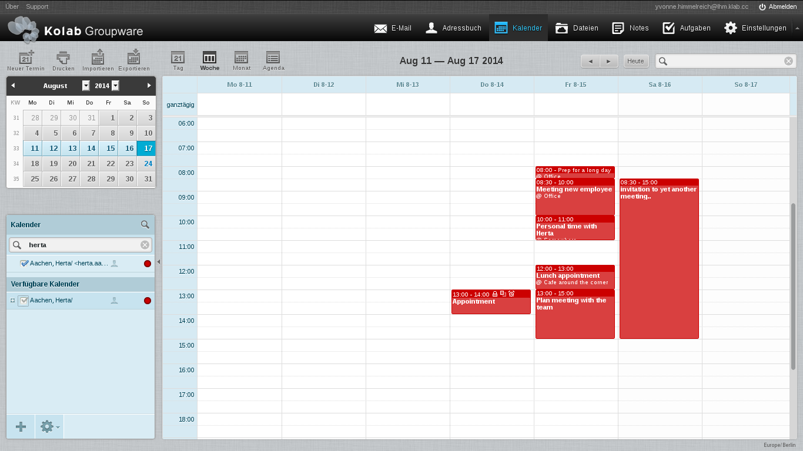
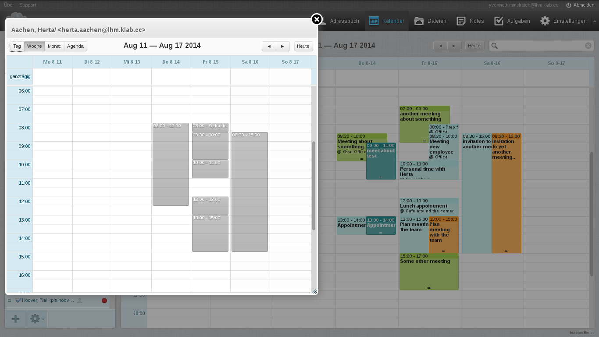
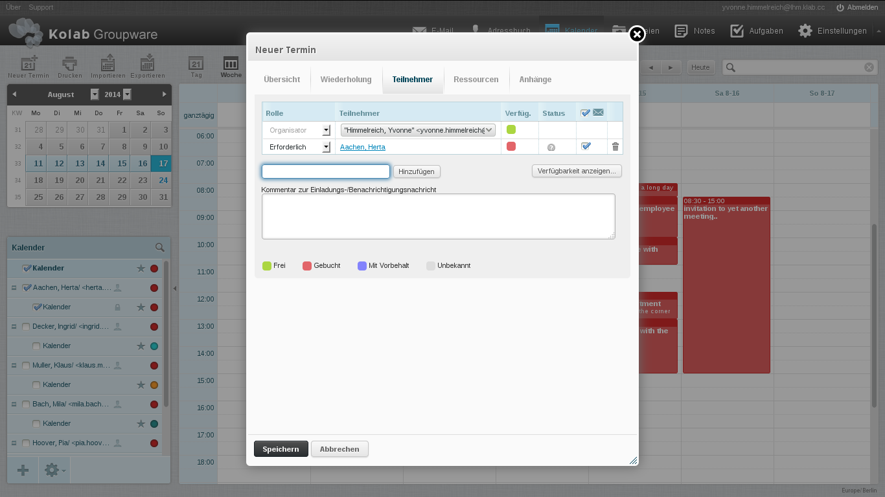
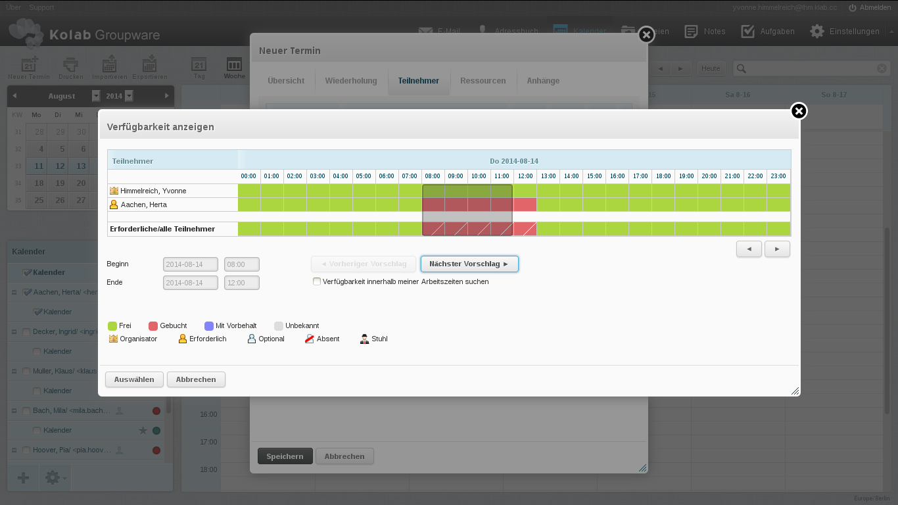
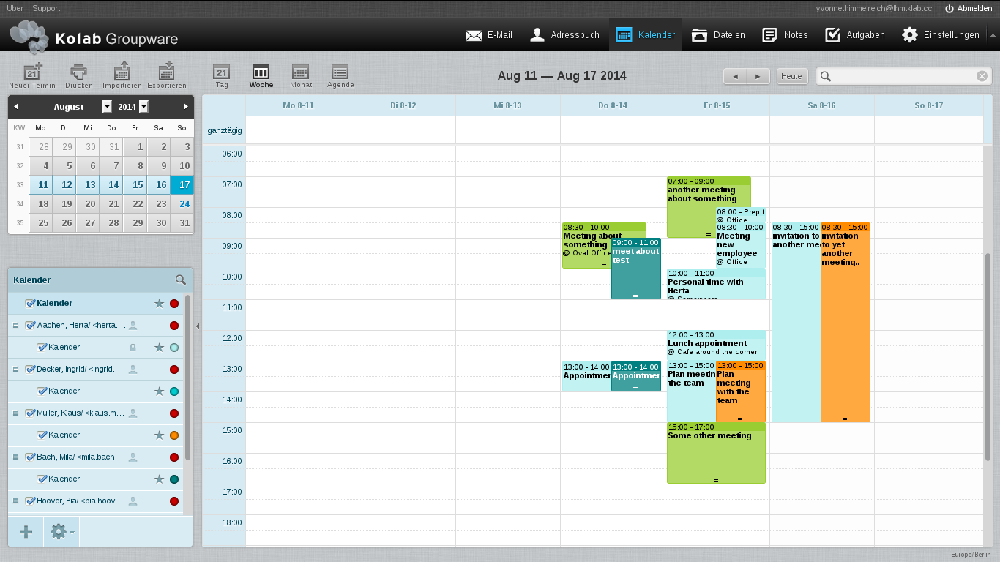

=====================================================================
Calendaring in (Large) Environments with Discretionary Access Control
=====================================================================

In larger environments with possibly tens of thousands of users,
exercising control over who has access to what calendar is a policy
challenge, especially considering the fact that Kolab Groupware's access
control is discretionary.

It is not uncommon for new consumers of Kolab Groupware to need to adapt
the Kolab Groupware solution to behave in a fashion that increases the
user acceptance, for these consumers may have previously worked with
another calendaring solution, and its users may have gotten used to how
said calendaring solution behaves.

To illustrate, a previous calendaring solution may have;

#.  offered only one (flat) calendar per user,

#.  based on :term:`mandatory access control`, or lack of any actual
    access control, allowed all users read- and/or write-access to all
    other user's calendars,

This builds a scenario in which users may have gotten acquainted with a
certain specific workflow, including;

#.  Meetings are not scheduled based on sending invitations around, let
    alone whether such invitations required a response [#]_,

#.  All details of all events in all calendars are visible to all users
    [#]_,

#.  A single copy of the event details exist, that is updated by other
    users, not on the basis of iTip responses, but on the basis of
    writing back a new version of the event to the calendar in which the
    event already existed [#]_,

#.  Availability information of other users is available based on the
    actual contents of a calendar -- with all details -- and not based
    on actual availability information (aka. Free/Busy) [#]_,

#.  It may have been the user interface application implementing the
    aspects of;

    *   A comprehensible view of an individual user's calendaring
        through filtering and/or selecting subsets of the available
        scheduling information,

    *   Filtering a user's view on items for display purposes, in a
        flawed attempt to implement access control, including the
        suppression of details of certain events, or the suppression of
        certain other people, in a flawed attempt to implement a form of
        invitation policy control.

Maintaining -- as much as possible -- the desired workflow of the users,
in order to increase the user acceptance, using Kolab Groupware while it
maintains :term:`discretionary access control` [#]_ builds the following
challenges to overcome;

#.  The owner of a calendar can remove entries from the access control
    list, revoking access to that calendar to certain or all other
    users [#]_.

#.  Users can create new calendars that do not have the policy applied,
    and not apply the access rights the organization's policy
    prescribes.

#.  Events that have a level of confidentiallity or that are private
    could be disclosed the details of unintentionally [#]_.

#.  Should users have gotten used to be able to write to one another's
    calendar(s), a level of automation using invitation policies in
    Kolab Groupware may unintentionally save new events with a level of
    confidentiality or that are private, in a calendar that is shared.

These challenges can be addressed as follows:

#.  Implement an invitation policy framework that allows for the
    automation of iTip message exchange processing, in full or in part.

#.  Allow rules used in the automated processing to control to which
    user's calendar a processed event should be saved,

#.  Make Kolab clients work based on the assumptions that;

    *   Each user may have access to all other user's calendars [#]_,

    *   Each user likely does not have access to any other user's
        calendars, let alone all other user's calendars [#]_ -- both
        applicable to an individual user's calendars and the collective
        of user's calendars.

If the environment wants to offer its users the opportunity to quickly
schedule meetings with other people, or simply check someone's
availability, but maintain control over who maintains access to what
information, the following is a suggested design for the resolution of
this conundrum;

With Kolab Groupware, in principle, no person other than the owner of a
calendar has access to that calendar, unless the owner has explicitly
delegated authority over that calendar, partly or in full -- shared
calendars notwithstanding. Kolab Groupware uses a concept of multiple
calendars to allow each calendar to have separate, different access
control applied to them, such that a user could have the following
calendars,

**Personal**

    A personal calendar, which may hold events such as Thursday
    evening's soccer practice and the Tuesday-morning dropping off of
    kids at school (and hence be at work a little later?).

    A human being might feel inclined to schedule these events in the
    groupware environment provided by their employer, but will then
    likely also feel inclined to not share the details with anyone else.

    Therefore, such calendar would, typically, not be shared with anyone
    else.

**Work**

    One or more work calendars, which may hold your typical meetings and
    other work-related agenda items.

    Such calendars are typically shared only with (some (direct))
    colleagues, but some of them may not be shared at all (such as one
    of manager's calendars that holds appointments with details to be
    kept confidential).

While the division of calendars across multiple folders may not seem
like a feature to be used all that extensively, to some people, please
note that each individual calendar can separately be enabled or disabled
alarms and/or mobile synchronization for. A user might block out
his or her day off (Friday) in an extra work calendar, but opt not to
synchronize this calendar to his or her mobile phone.

Such calendars with specific, special intentions tend to also *not* be
shared (although you could, there's little relevant information in
them for other people to subscribe to).

It is therefore understood that any particular user of the groupware
environment does **not** likely have direct (read-)access to all
calendars bearing potentially relevant information of the subjects for
whom scheduling information and/or availability is to be displayed.

Scheduling a New Event
======================

When a user *Jane* wants to schedule a meeting with a user *John*, one
of two action paths can be used;

#.  *Jane* opens the scheduling dialog, adds *John* as an attendee and
    subsequently assesses *John*'s availability using Free/Busy
    information.

#.  *Jane* searches for *John*'s scheduling information, displays the
    scheduling information as part of her own calendar view, and finds a
    time slot where both parties are available.

It is understood that the first methodology is much more scalable, and
much more accurate -- because Free/Busy information is the most complete
set of information concerning a person's availability.

When not one, but fifteen people need to be invited, the scheduling
dialog allows *Jane* to not have to choose a time slot first. This is
illustrated in `Figure #1`_ and also `Figure #2`_.

.. _Figure #1:

    **Figure #1**: *View of the initial scheduling dialog with many
    attendees*

.. _Figure #2:

    **Figure #2**: *View of availability information to find slots
    available*

Quickly Checking Availability
=============================

Under certain circumstances, a user may be inclined to (attempt to) open
a user's calendar(s) as opposed to scheduling a new meeting with
attendees.

Making use of the search box, contacts can be searched and their agenda
displayed quickly and efficiently.

After all, not all use-cases of opening up somebody else's calendar have
to do with actually scheduling a new event -- such as answering the
question, "Is *Herta* in the office on Thursday morning?".

Referring back to the nature of :term:`discretionary access control`,
and the variety of use-cases to use multiple calendar folders and
sometimes not share any let alone all of them, quickly opening
somebody's calendar must give the user the most complete view in two
senses;

#.  Availability information as the most complete view on somebody's
    time allocation,

#.  Any calendar the user does have (read-)access to for any details of
    the events as supplemental information.

In the following example, *Yvonne* has wanted to display *Herta*'s
calendar.

.. _Figure #3:

    **Figure #3**: *Quickly open another person's Calendar*

As shown in `Figure #3`_, where in this case the user does not have
access to any of the *Herta*'s calendars, the selection of a contact's
entry found does not currently result in the availability information
for said contact to be displayed as part of the current view, while
availability information is in fact available (`Figure #4`_).

To view the availability inforation dialog, an icon representing an
eyeball is located near the right-hand side of the list item in the
calendars list, but shown only when the mouse hovers over the list item.

The icons tooltip says *"View only this calendar"*, which does not
accurately represent what it actually does -- both not in the current
implementation nor in the target implementation.

.. _Figure #4:

    **Figure #4**: *Actual availability of another person*

In this scenario, *Yvonne* will initially be lead to believe that
*Herta*'s calendar is empty for the week, which users will usually be
able to conclude themselves is factually incorrect, but unless the
dialog displaying availability information for *Herta* is opened, no
information is made available. The information being one extra step away
will deter users.

While the availability information can only be viewed on a contact-by-
contact basis (ie. one at a time), this does not allow *Yvonne* to
schedule an event by looking at a combined calendar view of multiple
contacts' availability information. The now iterative process of viewing
people's availability one by one, rmembering what timeslots were
available for individual people, endlessly clicking to open and close
availability information views, will deter users.

Should *Yvonne* have had access to one or more of *Herta*'s calendars
however, the information that is currently displayed is still incomplete
(see `Figure #5`_) but since some events are displayed, it is **less**
likely to lead the user to determine the information is incomplete, and
is therefore even more misleading. As such, this implementation works
counter-intuitive, and will deter users.

.. _Figure #5:

    **Figure #5**: *Misleading, incomplete information display when
    selecting contact with user having access to calendar(s)*

Note that in this scenario, *Herta* initially appears to have nothing
scheduled for Thursday-morning, and *Yvonne* will not feel inclined to
open up the special view that uses the more authoritative availability
information, being mislead to believe the displayed contents are the
events in *Herta*'s agenda.

At this point, *Yvonne* may feel ready to respond to the question about
*Herta* being in the office on Thursday-morning -- perhaps falsely so.

*Yvonne* will have to realize that the information is likely incomplete,
separately open the availability information view for *Herta*.

This will suffice for the original question about *Herta* being in the
office on Thursday-morning, but will not suffice when attempting to
determine who's available on what day and at what time.

Here too, while the availability information can only be viewed on a
contact-by-contact basis (ie. one at a time), this does not allow
*Yvonne* to schedule an event by looking at a combined calendar view of
multiple contacts' availability information. In this scenario, some
timeslots that are "blocked" in the availability information correspond
with events that *Yvonne* can view the details for, since she has access
to some of *Herta*'s calendars.

`Figure #6`_ shows *Herta* is in fact not available on
Thursday-morning, and further illustrates that both workflows depicted
in `Figure #3`_ and `Figure #5`_ contain incomplete information, not
allowing the user to find a free timeslot among multiple contact's all
that easily.

.. _Figure #6:

    **Figure #6**: *Cluttered Calendar view despite not also including
    availability information*

When ultimately the actual scheduling dialog is now opened  [#]_, which
*Yvonne* might do on the premises that *Herta* is available on
Thursday-morning, *Yvonne* will only discover too late, that the
availability information is fundamentally different from the contents of
calendars displayed (`Figure #7`_, `Figure #8`_).

*Yvonne* will conclude the original view on *Herta*'s calendar contained
false or incomplete information but have no idea why, and feel it is
a software bug. A call to the helpdesk or a general feeling of
dissatisfaction with the groupware solution may be the result, and even
after *Yvonne* has been explained the intricacies of the particular
behaviour she is experiencing, there may be a ever lingering question of
*"But, why?"*.

It has been argued that the integration of a contact's availability
information in to the calendar view already available is likely to
clutter the interface, but it must be acknowledged that similar clutter
already occurs when only calendar contents are displayed (`Figure #7`_).

See `Figure #3`_ for the initial results should *Yvonne* not have access
to any of *Herta*'s calendars, and `Figure #5`_ for the initial results
should *Yvonne* have access to one of two of *Herta*'s calendars.

`Figure #5`_ will lead *Yvonne* to believe that *Herta* is available on
Thursday-morning, only to discover that *Herta* is not when creating a
new event for the timeslot (`Figure #8`_, `Figure #9`_).

.. _Figure #7:

    **Figure #7**: *Discover the attendee is busy after all (1)*

.. _Figure #8:

    **Figure #8**: *Discover the attendee is busy after all (2)*

.. _Figure #9:

    **Figure #9**: *Cluttered Calendar view despite not also including
    availability information*

.. _and-calendaring-quick-display:

The Quick Display Feature
=========================

The *Quick Display Feature* is a feature that addresses scalability
issues in the user interface, when large sets of calendars and/or
availability information are available to an individual user.

The former modus operandi for Kolab Groupware was based on the following
aspects [with functionality projected on to the current web interface
design and layout];

*   In version 2.3 of the Kolab Groupware solution, if the user had
    access to a calendar, this calendar would be listed in the lower
    left-hand list of calendars.

    This proved problematic when (icw.
    :term:`discretionary access control`) users started to give
    ``anyone`` read-access [#]_, and the calendar would solely therefore
    be included in the list of available calendars, with no possibility
    for the (consuming) user to remove the calendar in question from
    said list.

*   As of Kolab 3.0, a global setting controlled whether or not views on
    groupware content in the web client should use access rights or
    subscription status of folders to include in lists [#]_.

    That is to say, with this setting enabled, if the user had access to
    a calendar folder, this folder must first be subscribed and would
    then be displayed in the lower left-hand list of calendars.

    This proved to be problematic because users with access to many
    calendars have had to navigate to the folder management settings
    interface, subscribe a calendar folder, go back to the calendar
    view, and display the calendar's contents. The inverse series of
    actions removed the calendar from the list.

    In addition, the desktop client also maintained its list of
    calendars to synchronize (for off-line availability) based on the
    server-side subscriptions to folders. When a user unsubscribed a
    folder in the web client (in attempt to remove it from the list of
    calendars in the lower left-hand corner, which may have become
    cluttered), the calendar would therefore dissappear from the list of
    calendars in the desktop client.

*   In all versions of Kolab prior to 3.3, each calendar in the lower
    left-hand list of calendars would have a checkbox, controlling
    whether or not the contents of said calendar are displayed as part
    of the current view.

    This naturally scales only for a limited number of calendars
    included in said list, but still only includes calendars the user
    actually has access to.

In addition, these implementations were subject to the problem outlined
in [8]_, where no user could establish whether or not the set of
information displayed was a complete set or a subset.

The *Quick Display Feature* therefore implements the following logic to
facilitate a user's workflow in large-scale environments;

*   Only display calendars in the list that are subscribed IMAP folders,
    effectively establishing a list of persistent "favorites",

    *   For managers, these could be the calendars of subordinates,

    *   For colleagues, these could be the calendars of close
        colleagues,

    and those that have been selected during previous searches.

*   Introduce a search dialog that searches the address book for contact
    entries [#]_,

*   Allow the display of availability information for these contacts
    [#]_,

*   When a contact entry is selected for inclusion in to the current
    display, where applicable [#]_, determine whether access to any IMAP
    folders containing scheduling information exists, and if so;

    *   Display the event details for those timeslots in the
        availability information of the contact that match timeslots for
        events found, substituting the UI element that blocked the
        timeslot on the basis of availability information,

    If not, however, the Free/Busy information for the contact entry
    should be displayed.

*   Subscribe the virtual folder temporarily -- for the duration of the
    session, or until the virtual folder is explicitly removed,

*   Allow the user to execute subsequent searches for additional
    contacts, so that an aggregate view can be created composed of the
    availability information of multiple users, perhaps (incidentally)
    also with some event details (for those timeslots that have a
    corresponding event in any folder the user has access to).

*   Where contacts correspond with IMAP folders available for
    subscription, allow the contact entry to be expanded in to its
    individual components;

    #.  Availability information for the contact,

    #.  Each calendar folder in a hierarchy.

    so that individual folders can be subscribed separately from the
    contact's entry,

*   Where a user's calendars a user has access to have been selected
    (ie. the IMAP folders have been subscribed), continue to display the
    person selection entry not solely as a shortcut to enable display
    for all nested calendar folders, but also display complete
    information based on availability information.

.. rubric:: Footnotes

.. [#]

    Also called an RSVP -- Répondez S'il Vous Plaît.

.. [#]

    This would include events that are classified as private or
    confidential, while admittedly it may have been the user interface
    retrieving a (fully detailed copy of) the data choosing to suppress
    certain details -- leading users to believe mistakenly, the details
    are not visible to them.

.. [#]

    Writing back to one authoritative copy of the event directly implies
    that all event's attendees are aware of eachother's participant
    status.

.. [#]

    Availability information or Free/Busy is a published state of
    availability, that is stripped of all details of events that are not
    the timeslots of said event.

    Here too it may have been the user interface retrieving all details
    of all events but suppressing details, essentially faking an
    implementation of Free/Busy.

.. [#]

    A certain set of settings can result in mandatory access control, by
    revoking certain rights on all IMAP folders, but the user would not
    be able to create any new folders.

.. [#]

    The right to control a folder's ACL is the (a)dmin right, which also
    implies the right to control one's own access. While the ``a`` right
    can be revoked on calendar folders, other rights control whether the
    user is allowed to create new folders -- which inherit the rights of
    the parent folder. Should the ``a`` right be revoked on a calendar
    folder, a user will create a new calendar folder outside of the
    existing (tree of) calendar folder(s), and/or delete and recreate,
    and/or relocate the calendar folder in question. See
    :ref:`admin_imap-access-rights-reference` for a full list of rights
    available in IMAP to-date.

.. [#]

    Users may be better acquainted with the semantics of having access
    to eachother's calendars, and/or an organization's policies may be
    in the interest of transparency.

.. [#]

    Since each user may have access to any or all of other user's
    calendars [8]_, in larger organizations this may lead a user to have
    access to tens of thousands of calendars. This presents a
    scalability problem in the user interface that is addressed with a
    :ref:`and-calendaring-quick-display` interface.

.. [#]

    Using Kolab Groupware, the only credentials used to view content are
    the individual user's credentials. As such, the user may have access
    to a number of calendars, but will never be able to determine
    whether or not those are **all** calendars. The user is therefore
    unable to determine whether the set of information pulled from the
    calendars the user does have access to is a complete set of
    information.

.. [#]

    Note that both the button *"New event"* as well as clicking on an
    empty space in the calendar opens up this dialog. It is very common
    for users, however, to use the latter method, and poke directly at
    an open timeslot.

.. [#]

    It is possible to not allow individual users to make use of the
    ``anyone`` access control subject identifier, but this does not
    address the underlying UI scalability issue -- under the eventuality
    clause, eventually someone will have access to too many folders.

.. [#]

    This setting is :ref:`admin_roundcube-settings-plugin_libkolab_kolab_use_subscriptions`.

.. [#]

    The dialog is specifically geared towards searching for contacts, as
    opposed to IMAP folders the user has access to, for the complete set
    of items retrievable includes the Free/Busy status of any contact --
    both internally, as well as externally should the address book entry
    have the ``FBURL`` property set.

    Searching for address book entries addresses both [8]_ as well as
    the need for users to schedule appointment with other parties.

.. [#]

    The availability information may in fact be available external to
    the organization, and supplement a contact's information using the
    ``FBURL`` property in vCard/xCard.

.. [#]

    Users in the same authorization realm -- when the groupware
    environment is homogeneous.
