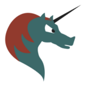

.. _settings-clientconfig-emacs:

Emacs
-----

Many IT professionals use `Emacs <https://www.gnu.org/software/emacs/>`__
to handle most of their everyday computer tasks.
Some people even consider emacs an entire operating system.
Please see below for the instructions on setting up emacs with |service_name|.

org-mode Calendar
^^^^^^^^^^^^^^^^^

In order to sync your Emacs org-mode calendar with |service_name|,
you have to setup `*org-caldav mode* <https://github.com/dengste/org-caldav>`__. 
Just install that and add the following to your Emacs configuration:

.. parsed-literal::

    (require 'org-caldav)

    ;; The CalDAV URL with your full and primary email address at the end.
    (setq org-caldav-url "|caldav_uri_long|")

    ;; The name of your calendar, typically "Calendar" or similar
    (setq org-caldav-calendar-id "Calendar")

    ;; Local file that gets events from the server
    (setq org-caldav-inbox "~/doc/org/mobile.org")

    ;; List of your org files here
    (setq org-caldav-files org-agenda-files)

    ;; Please make sure to set your correct timezone here
    (setq org-icalendar-timezone "Europe/Helsinki")
    (setq org-icalendar-date-time-format ";TZID=%Z:%Y%m%dT%H%M%S")

Please note that you need to change your username and the timezone.
Review this configuration carefully and adapt it to your needs.
Then you should be set.
Just run *org-caldav-sync* and wait a bit, the first time takes a good while.

If your calendar has a different name, you can find out the Calendar ID for it
by using the option *Show Calendar URL* from the |service_name| webclient.
To get this URL, please login to |service_uri| and then follow the following steps:

#.  Select *Calendar* in the top right corner drop-down menu

#.  Select the calendar you wish to add to Emacs with a 
    single left click in the lower left corner. The selected calendar 
    should visibly highlight.

#.  Next click on the small gear symbol below

#.  From the menu you'll see, please select *Show Calendar URL*

#.  In the window that will appear please copy the end of the second URL
    (where it says CalDAV)

The Calendar ID is the text and numbers (e.g. Calendar) after the last */*. 

.. container:: screenshots

    .. fancyfigure:: _static/roundcube-calendar-caldav-uri.png
        :group: roundcube
        :height: 200
        :alt: Find CalDAV URL in Webclient

        .. fancyrender::
            :font: verdana
            :size: 12

            |caldav_uri_long|/Calendar @275,245

